# 实验3：创建分区表
## 罗莹 软工4班 201810414405
### 实验目的：
#### 掌握分区表的创建方法，掌握各种分区方式的使用场景。
### 实验内容：
- **本实验使用3个表空间：USERS,USERS02,USERS03。在表空间中创建两张表：订单表(orders)与订单详表(order_details)。**
- **使用你自己的账号创建本实验的表，表创建在上述3个分区，自定义分区策略。**
- **你需要使用system用户给你自己的账号分配上述分区的使用权限。你需要使用system用户给你的用户分配可以查询执行计划的权限。**
- **表创建成功后，插入数据，数据能并平均分布到各个分区。每个表的数据都应该大于1万行，对表进行联合查询。**
- **写出插入数据的语句和查询数据的语句，并分析语句的执行计划。**
- **进行分区与不分区的对比实验。**
### 实验步骤
- **第1步：以System身份登录，更改用户的权限**
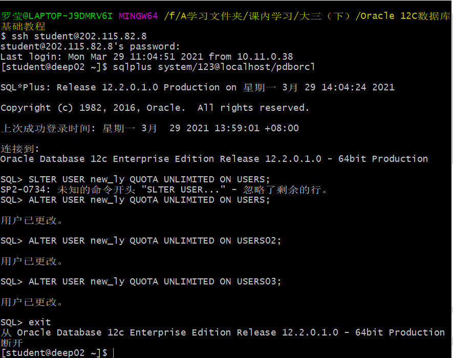
- **第2步：以自己的账号new_ly身份登录,并运行脚本文件test3.sql**
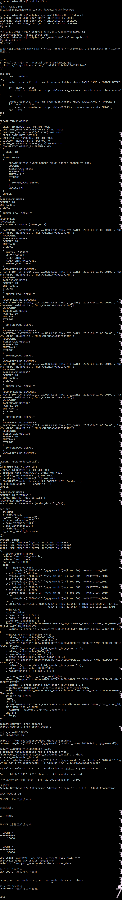
- **第3步：从pdborcl创建可插接数据库ly**
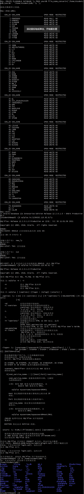
- **第4步：打开可插入数据库ly**

- **第5步：新建立连接system_ly**
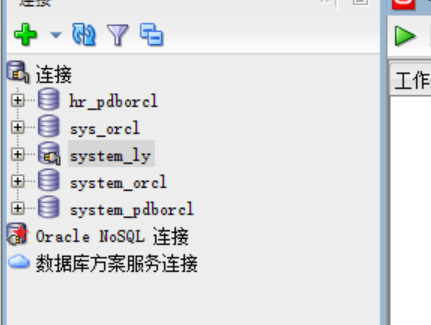
#### 在主表orders和从表order_details之间建立引用分区 在study用户中创建两个表：orders（订单表）和order_details（订单详表），两个表通过列order_id建立主外键关联。orders表按范围分区进行存储，order_details使用引用分区进行存储。
- **第7步：创建users02**
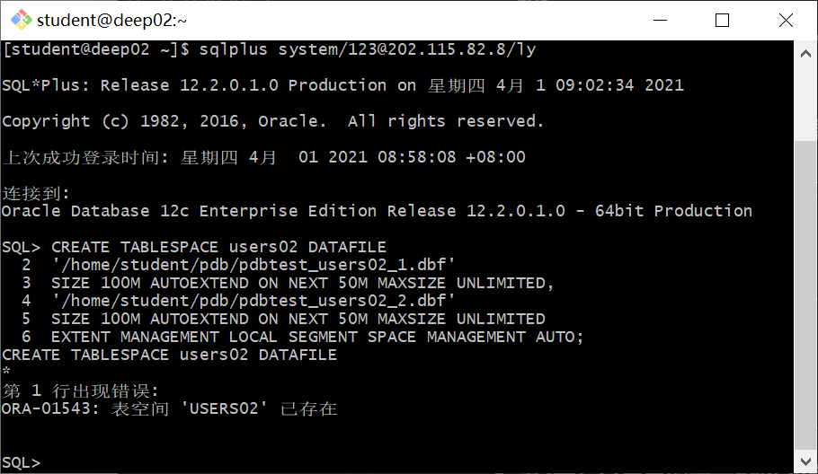
- **第8步：创建users03**

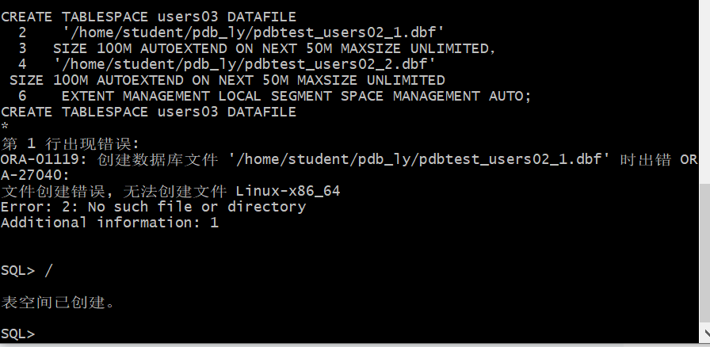
- **第9步：新建立连接new_ly_ly**
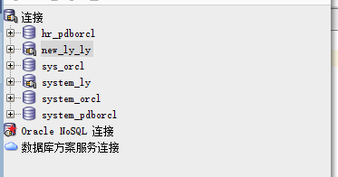
- **第10步：以system用户登录ly数据库，修改users02、users03的权限**
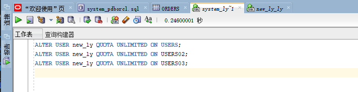
- **第9步：创建orders表**
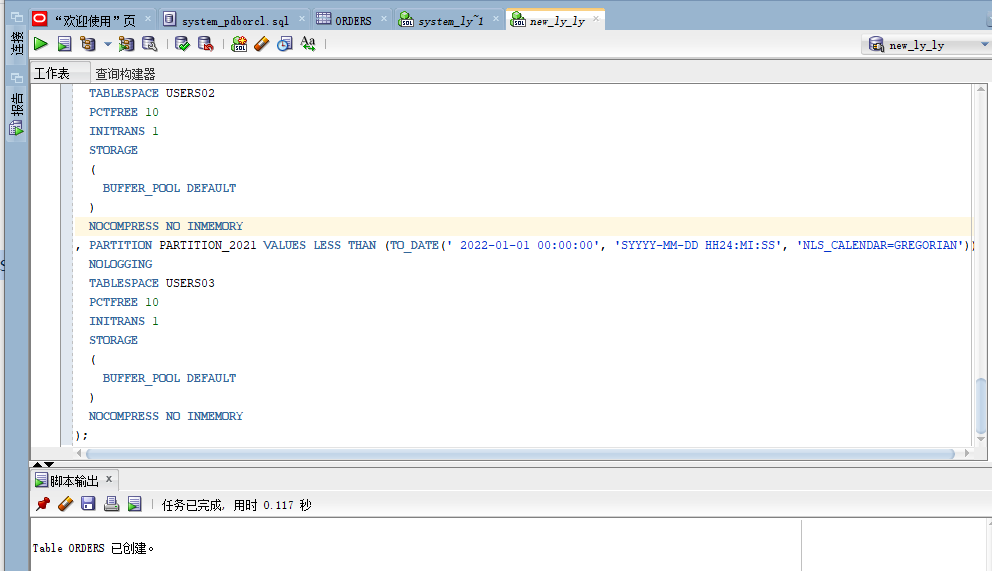
- **第10步：创建order_details表**
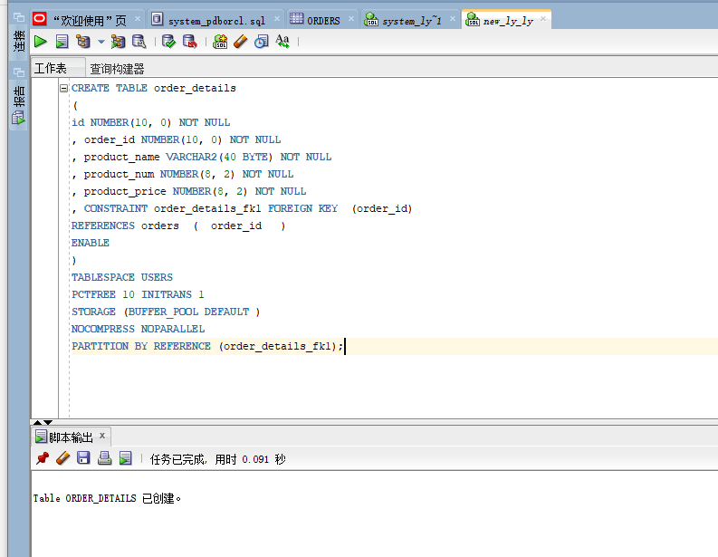
- **第11步：查找信息**
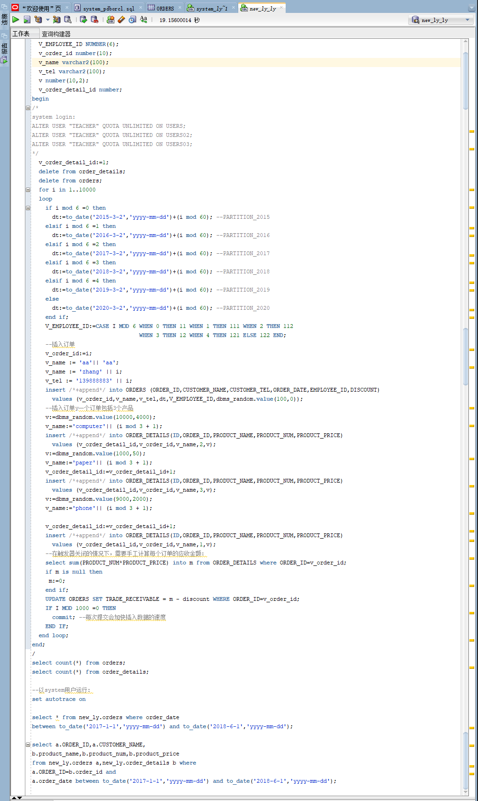
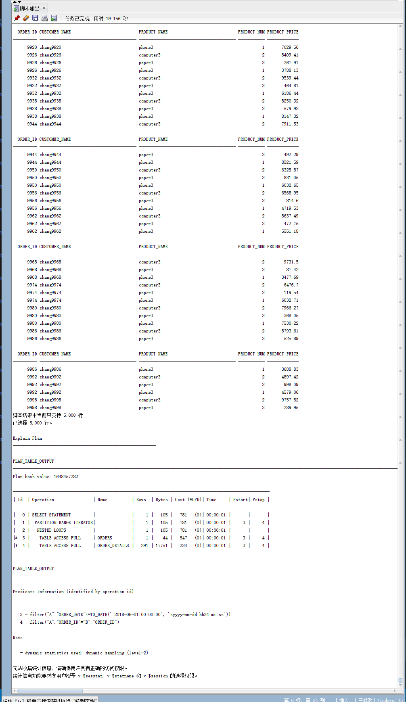
- **第12步：查看表空间的数据库文件，以及每个文件的磁盘占用情况。**
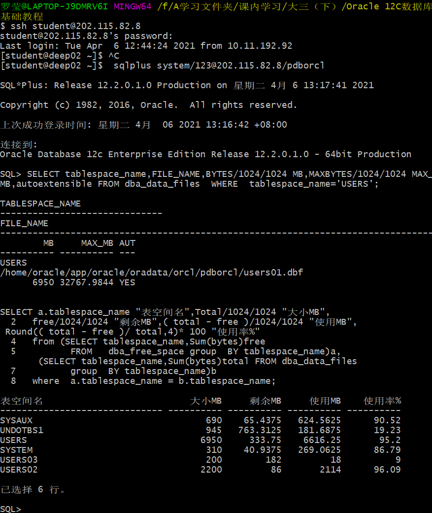
#### autoextensible是显示表空间中的数据文件是否自动增加
#### MAX_MB是指数据文件的最大容量。
